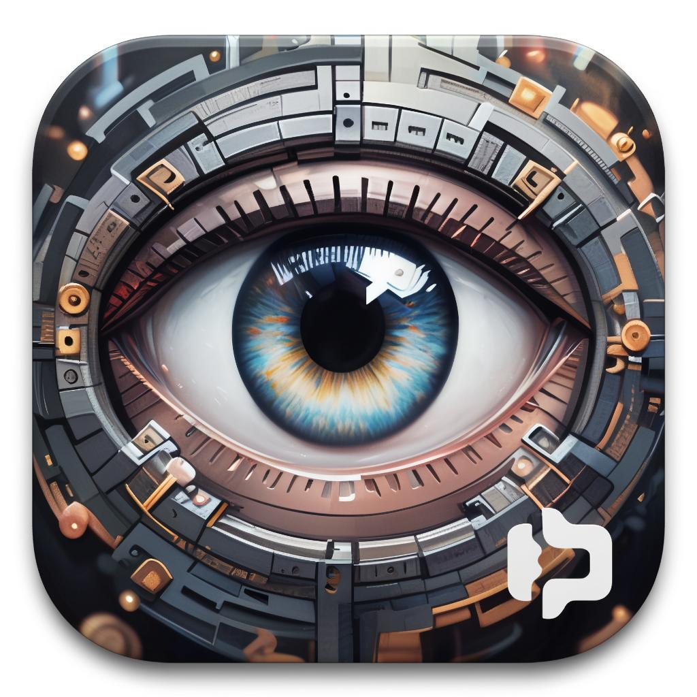

# REChain®️ VC Lab

<div align="center">
  
  
  <h3>🚀 Next-Generation Web3/Web4/Web5 Venture Capital Platform</h3>
  
  [](https://flutter.dev/)
  [](https://dart.dev/)
  [](LICENSE)
  [](https://flutter.dev/)
</div>

https://api.codemagic.io/apps/68bc414a6623c271121c1cd9/68bc414a6623c271121c1cd8/status_badge.svg

[](https://codemagic.io/app/68bc414a6623c271121c1cd9/68bc414a6623c271121c1cd8/latest_build)

## 🌟 Overview

REChain®️ VC Lab is a revolutionary Flutter application that implements the complete evolution of the internet: **Web3 (Ownership) → Web4 (Movement) → Web5 (Creation)**. Built on the philosophy of Katya AI Systems LLC, this platform empowers users to own their digital world, create movement trajectories, and collaborate with AI to build new digital realities.

## 🎯 Key Features

### 🔗 Web3 - Ownership
- **Blockchain Integration**: DeFi protocols, NFT marketplaces, DEX trading
- **Crypto Wallets**: Multi-chain wallet support with secure transactions
- **Web3 Identity**: Decentralized identity management
- **Cross-chain Bridges**: Seamless asset transfers across blockchains
- **DAO Governance**: Decentralized autonomous organization tools

### 🚀 Web4 - Movement
- **Movement Trajectories**: Create and track personal development paths
- **Digital Identities**: Multiple digital personas with skills and connections
- **Progress Tracking**: Visual progress monitoring across all trajectories
- **Movement Map**: Interactive visualization of your digital journey

### ✨ Web5 - Creation
- **Creation Projects**: Collaborative projects with AI assistance
- **AI Collaborators**: Specialized AI helpers for different creative domains
- **Creative Moments**: Capture and share inspiration and breakthroughs
- **Creation Studio**: Interactive workspace for human-AI collaboration

### 🎮 Additional Features
- **Achievement System**: Gamification with rewards and levels
- **Reputation System**: Community-driven reputation and ratings
- **Real-time Notifications**: Instant updates and alerts
- **Social Network**: Connect with the Web3 community
- **Mentorship Platform**: Learn from industry experts
- **Analytics Dashboard**: Comprehensive insights and reporting

## 🏗️ Architecture

### Technology Stack
- **Framework**: Flutter 3.35.2 with Dart 3.9.0
- **State Management**: Provider pattern
- **UI/UX**: Material Design 3 with custom theming
- **Storage**: SharedPreferences for local data persistence
- **Animations**: flutter_animate for smooth transitions

### Project Structure
```
lib/
├── providers/          # State management (30+ providers)
│   ├── web3/          # Web3 functionality
│   ├── web4/          # Web4 movement features
│   ├── web5/          # Web5 creation features
│   └── social/        # Social and community features
├── screens/           # UI screens (30+ screens)
│   ├── web3/          # Web3 interfaces
│   ├── web4/          # Web4 movement screens
│   ├── web5/          # Web5 creation screens
│   └── social/        # Social features
├── widgets/           # Reusable UI components
├── utils/             # Utilities and helpers
└── models/            # Data models
```

## 🚀 Getting Started

### Prerequisites
- Flutter SDK 3.35.2 or higher
- Dart SDK 3.9.0 or higher
- Android Studio / VS Code
- Git

### Installation

1. **Clone the repository**
   ```bash
   git clone https://github.com/yourusername/rechain-vc-lab.git
   cd rechain-vc-lab
   ```

2. **Install dependencies**
   ```bash
   flutter pub get
   ```

3. **Run the application**
   ```bash
   # Debug mode
   flutter run
   
   # Release mode
   flutter run --release
   ```

### Building for Production

#### Android
```bash
# Debug APK
flutter build apk --debug

# Release APK
flutter build apk --release
```

#### iOS
```bash
flutter build ios --release
```

#### Web
```bash
flutter build web --release
```

## 📱 Platform Support

| Platform | Status | Notes |
|----------|--------|-------|
| **Android** | ✅ Complete | API 21-34, fully optimized |
| **iOS** | 🟡 Basic | Core functionality ready |
| **Web** | 🟡 Basic | Progressive Web App support |
| **Windows** | 🟡 Basic | Desktop application |
| **macOS** | 🟡 Basic | Native macOS support |
| **Linux** | 🟡 Basic | Linux desktop support |

## 🔧 Configuration

### Android Setup
The Android project is fully configured with:
- **Package**: `com.rechain.vc`
- **Min SDK**: 21 (Android 5.0)
- **Target SDK**: 34 (Android 14)
- **MultiDex**: Enabled for large apps
- **ProGuard/R8**: Optimized for release builds
- **Permissions**: Web3 functionality permissions
- **Security**: Network security configuration

### Environment Variables
Create a `.env` file in the root directory:
```env
# Blockchain RPC URLs
ETHEREUM_RPC_URL=https://mainnet.infura.io/v3/YOUR_KEY
POLYGON_RPC_URL=https://polygon-mainnet.infura.io/v3/YOUR_KEY

# API Keys
INFURA_API_KEY=your_infura_key
ALCHEMY_API_KEY=your_alchemy_key

# App Configuration
APP_NAME=REChain VC Lab
APP_VERSION=1.0.0
```

## 🎨 Design Philosophy

### Web3 - Ownership
> "Я хозяин своей цифровой реальности"
- Users own their data, identity, and assets
- Decentralized protocols and smart contracts
- Self-custody of digital assets

### Web4 - Movement
> "Создавайте новые траектории в цифровом мире"
- Active creation of development trajectories
- Dynamic interconnected environment
- Multiple digital identities and personas

### Web5 - Creation
> "Человек становится соавтором самой цифровой реальности"
- Human-AI collaborative creation
- Building new digital worlds
- Unlocking human creative potential

## 🤝 Contributing

We welcome contributions! Please see our [Contributing Guidelines](CONTRIBUTING.md) for details.

### Development Workflow
1. Fork the repository
2. Create a feature branch (`git checkout -b feature/amazing-feature`)
3. Commit your changes (`git commit -m 'Add amazing feature'`)
4. Push to the branch (`git push origin feature/amazing-feature`)
5. Open a Pull Request

## 📊 Project Status

### Current Version: 1.0.0
- ✅ Core Web3/Web4/Web5 architecture
- ✅ 30+ providers and screens
- ✅ Android optimization and builds
- ✅ Security and performance optimization
- ✅ Demo data and functionality

### Roadmap
- [ ] Real blockchain integrations
- [ ] AI assistant implementations
- [ ] Advanced analytics
- [ ] Mobile app store deployment
- [ ] Community features expansion

## 🐛 Bug Reports

Found a bug? Please create an issue using our [Bug Report Template](.github/ISSUE_TEMPLATE/bug_report.md).

## 💡 Feature Requests

Have an idea? Please create an issue using our [Feature Request Template](.github/ISSUE_TEMPLATE/feature_request.md).

## 📄 License

This project is licensed under the MIT License - see the [LICENSE](LICENSE) file for details.

## 🙏 Acknowledgments

- **Katya AI Systems LLC** - For the visionary Web4/Web5 concepts
- **Flutter Team** - For the amazing framework
- **Web3 Community** - For inspiration and collaboration
- **Open Source Contributors** - For the tools and libraries

## 📞 Contact

- **Project**: [REChain VC Lab](https://github.com/yourusername/rechain-vc-lab)
- **Issues**: [GitHub Issues](https://github.com/yourusername/rechain-vc-lab/issues)
- **Discussions**: [GitHub Discussions](https://github.com/yourusername/rechain-vc-lab/discussions)

## 🌟 Star History

[](https://star-history.com/#yourusername/rechain-vc-lab&Date)

---

<div align="center">
  <p>Built with ❤️ by the REChain VC Lab Team</p>
  <p>Empowering the future of Web3, Web4, and Web5</p>
</div>
